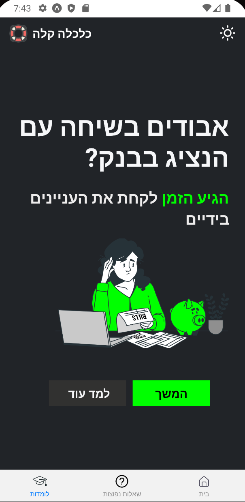

# כלכלה קלה

אפליקציה חינמית המספקת מידע נגיש בעברית על מונחים כלכליים בסיסיים לצורך שיפור המודעות וההתנהלות הכלכלית.

## רציונל

 
אף על פי יוקר המחיה הגועש והמחירים שמטפסים, בוגרי מערכת החינוך בישראל לא מקבלים את הידע הדרוש על מנת לתרגל התנהלות כלכלית נכונה ומושכלת. בשל כך רבים נותרים עם הבנה לוקה של נושאים בסיסיים וחוסר יכולת להתנהל מול בנקים וגופים פיננסים גדולים, שפעמים רבות אף מסתמכים על חוסר הידע המדובר. 

אנחנו חושבים שצריך להתחיל בהתחלה, כלומר, יצירת פלטפורמה נוחה וחינמית שתנגיש תוכן קצר וברור בנושאים הללו, ותהפוך את המושגים המבלבלים והלא מובנים לקלים ומובנים מאליהם. לכן התחלנו לפתח את ״כלכלה קלה״, אפליקציה שעושה בדיוק את זה.

## התקנה

היישום יהיה זמין בחנות האפליקציות של גוגל (Google Play). לנוחיותכם, הוא חינמי וללא פרסומות.

## תצוגה מקדימה

